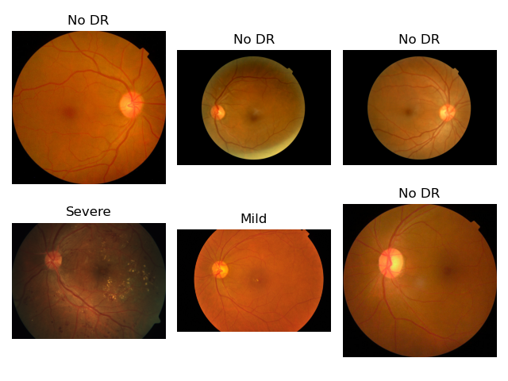
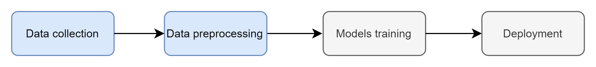

# 2DR

## **1. Description**

Prediction of Retinopathy Stages: Using a fundus image, the artificial intelligence system predicts the corresponding stage of retinopathy. Diabetic retinopathy, a complication of diabetes, affects the blood vessels that supply the retina. If not detected early, it can lead to blindness. To address this, diabetics need to regularly consult an ophthalmologist. Unfortunately, in some developing countries in particular, access to a doctor, especially an ophthalmologist, is very challenging. That is why we propose a smartphone-based system to automatically detect stages of diabetic retinopathy. Thus, with equipment capable of obtaining a fundus image and sending it via a smartphone, diabetic patients can promptly receive a diagnosis corresponding to their disease stage, simplifying their medical monitoring.

Some fondus images with correspondent Ret stades

## 2. Methodology

**Data collection**

- Retinopathy is obtained from Kaggle: [APTOS 2019 Blindness Detection](https://www.kaggle.com/competitions/aptos2019-blindness-detection/data)

- It comprised about xxx images
- Four stades of Retinopathy : xxx

**Data cleaning and preprocessing**

- Resizing, normalization, data augmentation etc

**Models training**

- A custom convnets and VGG16 is used
- Metrics: accuracy, precision, recall

**Deployment**

- Flask API
- Frontend : React JS

## 3. Deployment

## 4. Future deve

- Embedded models