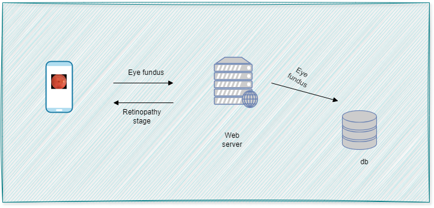
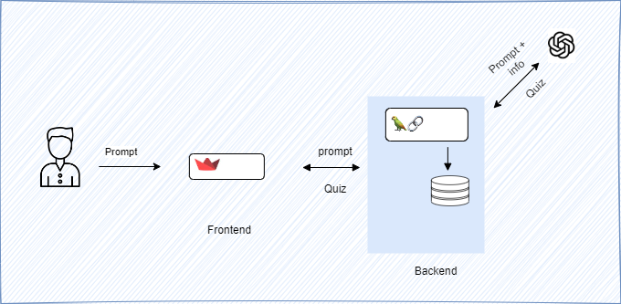
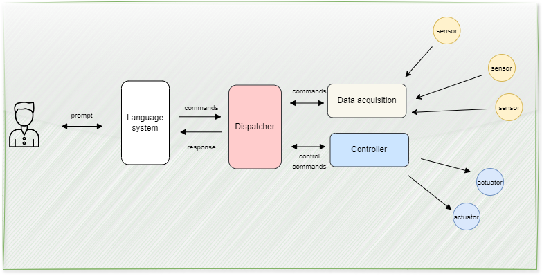

# EasyML
This repo contain all small projects, that I built it's mostly for a concept check.
From training, testing to deploying models with API.
- Dr.EYE
- Mr. Weather
- iManager
- QuizMaker
## 1. Dr. EYE

In certain rural African villages, accessing an ophthalmologist is a luxury. Individuals suffering from eye diseases often lack proper treatment due to the scarcity of specialists, leading to a worsening of their conditions and frequently resulting in blindness, particularly for those with diabetic retinopathy. Therefore, an AI system capable of automatically detecting stages of retinopathy from fundus images could provide significant assistance. The following steps outline the process to develop such a system.

- Take eye fondus and send it to server
- The eye fondus follow some processing and then give to the model to get the corresponding Retinopathy stage
- Return the response to the user

A convolutional neural network is used as the model. The dataset xxx from kaggle is used to train it. A Flask app is used as the backend and a streamlit app as the frontend.

## 2. QuizMaker
Large language models are very good at generating text. LLMs such as ChatGPT are now largely used by students to master or at least understand some concepts. This is a small app that uses OpenAI API to generate a quiz on a given topic. It can also use student documents to respond to questions. Tools
used :

- OpenAI API
- Streamlit
- LangChain
- Huggingface 

.
## 3. OOI
With advance of AI, we can be able to communicate with any objects (machine) using natural language 
As AI advances, language models enables us to communicate with machines as if they were intelligent entities. Imagine being able to inquire if your refrigerator has enough of your favorite snacks for the week, or directing a security drone to focus on a specific target. This capability could fundamentally change how we perceive and interact with technology. Currently, language models are not fully optimized for use on smartphones or smaller computers with limited processing power. However, future developments are expected to introduce new, less resource-intensive architectures that could run efficiently on less powerful devices. In the meantime, OIO has leveraged the OpenAI API, Arduino, and sensors to create an app we can interact by using english. This app allows users to ask questions about the location of objects, ambient temperature, and humidity, and to store this data for predictive modeling by language models. Tools used include:

- OpenAI API
- LangChain
- Arduino
- Sensors: temperature, hummidity, sensors

You can all ask information to be retrieved but you can not command or control the system at the moment.

## 4. iManager

Google has recently released magika models. magika is a tiny model that can predict the extension of a given file. This tiny package contain functions built upon the magika model. It provided functions for splitting  files into diffent folders according to their extensions, for checking binary files in folders, for creating folders, etc. Found the magika very practical and I used to check for binary files when downloaded or before submit files from user to the servers in apps.

## 5. Accident detection